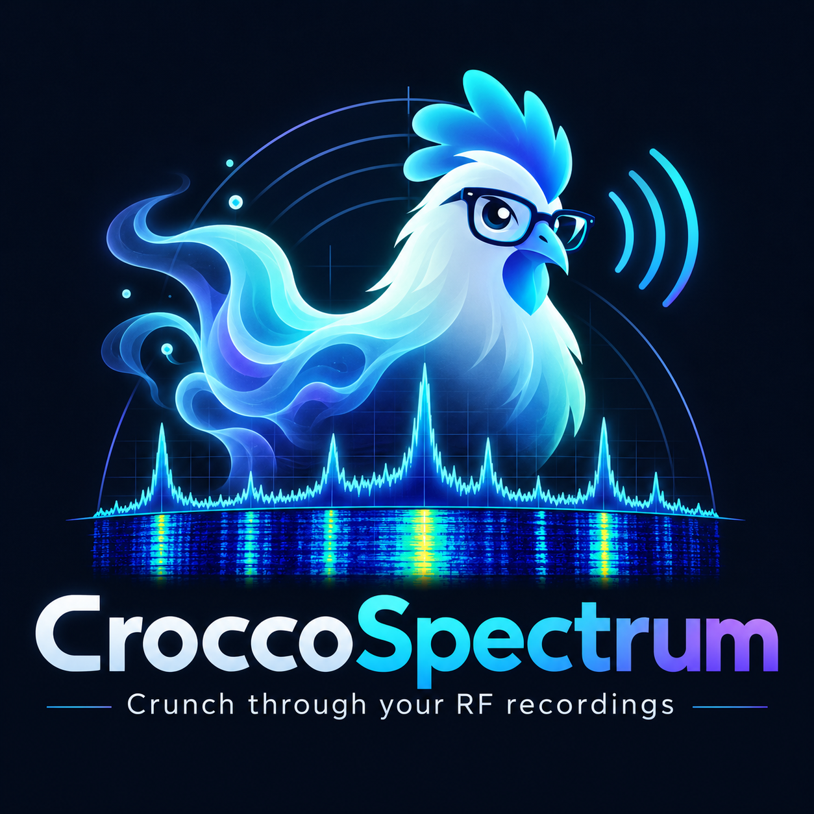
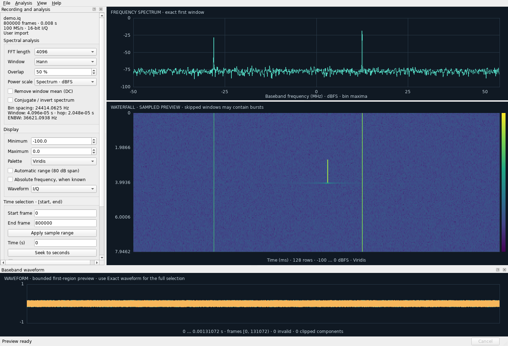

<p align="center">
  
</p>

<h1 align="center">CroccoSpectrum</h1>

<p align="center">
  <strong>Explore your spectrum. Find your signals. Understand your recordings.</strong><br>
  Native Linux analysis for large offline RF recordings.
</p>

<p align="center">
  <a href="#build-from-source"></a>
  <a href="#features"></a>
  <a href="#linux-support"></a>
  <a href="CHANGELOG.md"></a>
  <a href="LICENSE"></a>
</p>

<p align="center">
  <a href="#quick-start">Quick start</a> ·
  <a href="#features">Features</a> ·
  <a href="#recording-formats">Formats</a> ·
  <a href="#command-line-tools">CLI</a> ·
  <a href="#build-from-source">Build</a> ·
  <a href="#documentation">Documentation</a>
</p>

---

CroccoSpectrum turns real and complex I/Q recordings into interactive spectrum,
waterfall, and waveform views. Open a recording, review its interpretation, and
move from a quick overview to an exact analysis of the interval that matters.

Recordings are read in bounded blocks, so a larger file does not require loading
it into RAM. FFTs, scans, and data exports run in the background with cancellation.
The application analyzes completed recordings or the downloaded portion of a
growing file without requiring RF hardware or an acquisition driver.

## In action



<p align="center">
  <em>A synthetic 100 MS/s I/Q recording, with a shared time selection and dockable analysis panels.</em>
</p>

## Features

| | Capability | What you can do |
| --- | --- | --- |
| 📡 | **Spectrum & waterfall** | Inspect frequency content immediately after opening a recording; zoom and pan through time and frequency |
| 🔬 | **Configurable DSP** | Choose power-of-two FFTs, four window functions, overlap, DC removal, and spectral inversion |
| 📊 | **Exact analysis** | Calculate interval or whole-recording averages, max hold, and a waterfall overview that scans every required window |
| 🌊 | **Waveform inspection** | View I/Q, magnitude, or I-only samples; scan exact min/max envelopes to preserve isolated peaks |
| 🎨 | **Display controls** | Adjust color limits and switch between Viridis, Inferno, Grayscale, Turbo, and Baudline (black to `#00F9AB`) without recomputing FFTs |
| 🧭 | **Flexible workspace** | Dock or float panels, seek by sample or time, and navigate with linked views and cursor readouts |
| 💾 | **Sessions & exports** | Save interpretation, settings, selections, and bookmarks; export numeric CSV, plot PNG, or original sample bytes |
| 📦 | **Portable Linux packages** | Run an AppImage or extractable folder with bundled application libraries, Qt plugins, and fonts |
| 🛠️ | **Headless tools** | Inspect recordings and generate spectra, averages, waveforms, and sample exports from the command line |

The [feature-status table](FEATURE_STATUS.md) lists implemented capabilities,
supported formats, and verification results.

## Quick start

### Download a release

Open [Releases](https://github.com/gioeleminardi/CroccoSpectrum/releases) and
download the AppImage or portable tarball from **Assets**. New releases and
development prereleases are published with packages, accompanying sources,
checksums, and build information after their verification workflow succeeds.

The [download website](https://gioeleminardi.github.io/CroccoSpectrum/#download)
offers the stable release and latest successful development build separately.
Development versions such as `0.2.0-dev.184.g233be51` identify the planned release,
CI run, and source commit. They are intended for beta testing. See [release workflow](docs/CI.md#publish-a-stable-release)
for development and stable publication instructions.

### Download a CI build

On GitHub, open **Actions → a successful workflow run → Artifacts** and
download **CroccoSpectrum-linux-amd64-AppImage** or
**CroccoSpectrum-linux-amd64-portable**. Each artifact ZIP contains one file:
the AppImage or the extract-and-run tarball. Accompanying sources are in
**CroccoSpectrum-linux-amd64-sources**; checksums are in **reports-release**.
Debug and ASAN/UBSAN builds can be run locally for development. See [CI builds](docs/CI.md)
for artifact contents, retention, and runner setup.

### Update notifications

The GUI checks GitHub for stable releases five seconds after each startup and
every 24 hours while running. A newer version is announced only after both Linux
packages and their checksums are uploaded. The notification opens the
[CroccoSpectrum website](https://gioeleminardi.github.io/CroccoSpectrum); download
and install the package yourself.

Use **Help → Automatically check for updates** to disable background checks, or
**Help → Check for updates…** to check manually. Automatic failures stay quiet;
manual checks report connection errors and rate limits. Each version is announced
automatically once per app session until you install it. Startup checks respect
GitHub's retry limits. Checking sends a request to GitHub; recordings and sessions
are not included. The CLI, tests, screenshots, and smoke tests stay offline.

### Run an AppImage

With a packaged AppImage in the current directory:

```sh
chmod +x croccospectrum-0.2.0-x86_64.AppImage
./croccospectrum-0.2.0-x86_64.AppImage
```

To launch without FUSE:

```sh
./croccospectrum-0.2.0-x86_64.AppImage --appimage-extract-and-run
```

### Run the portable folder

```sh
tar -xzf croccospectrum-0.2.0-x86_64.tar.gz
./croccospectrum-0.2.0-x86_64/AppRun
```

Packaged builds include their application dependencies. The host supplies Linux,
glibc, the display server, and graphics drivers. To compile the application,
follow [Build from source](#build-from-source).

### Open your first recording

1. Select **File → Open recording**.
2. Review the sample format, byte order, I/Q order, and sample rate in the import
   dialog. The decoded preview helps verify the interpretation.
3. Explore the default spectrum and waterfall. Select an interval and use the
   **Analysis** menu for averages, an exact overview, or an exact waveform scan.

The initial raw-file preset is **signed int16 · complex I/Q · little-endian ·
100 MS/s**. Raw files do not describe their own layout: use the recording
writer's format and rate. At this preset, 400 MB of samples represents one second.

Use **File → Open recent** to reopen the ten most recent recordings and sessions
across launches. Recording entries open the interpretation dialog; session
entries restore their saved settings. Use **Clear recent files** to reset the list.

## Recording formats

| Property | Supported values |
| --- | --- |
| Sample kind | One real stream or one complex I/Q stream |
| Component order | Interleaved IQ or QI |
| Integer encoding | Signed or unsigned 8, 16, packed 24, 32, and 64-bit |
| Floating-point encoding | IEEE FP16, FP32, and FP64 |
| Byte order | Little-endian and big-endian |
| Sample rate | Finite positive rates, including fractional values and scientific notation |
| Raw data layout | Explicit byte offset and optional data length |
| Metadata | Supported single-stream SigMF core subset and exported `.rfmeta.json` descriptors |

The DSP core uses double precision. Floating-point inputs have an explicit
full-scale reference; 64-bit integer inputs are decoded with the precision limits
of double-precision analysis.

Open a `.sigmf-meta` file to use its recording metadata, or a `.rfmeta.json` file
to reopen an exported sample range. Required unsupported SigMF extensions,
multiple streams, and later embedded capture headers are rejected explicitly.

For a recording still downloading through scp or rsync, enable **Open partial /
growing file** in the import dialog, or pass `--partial` to the CLI. This opens a
fixed snapshot of the complete sample frames currently available, ignores an
incomplete final frame, and limits declared data lengths, captures, and
annotations to that snapshot. At least one complete frame must be present;
metadata JSON must already be complete.

The transfer may append bytes and update timestamps while analysis continues.
The downloaded prefix must remain unchanged: this mode does not detect edits
within that prefix and cannot identify undownloaded regions in preallocated
files. Truncation below the opening file size or path replacement stops reads.
Reopen the original file to include newly downloaded samples; saved sessions
retain their snapshot length and metadata. Ordinary imports retain strict
file-change and frame validation.

Optional capture timestamps and center frequencies add UTC and absolute-frequency
readouts. Exact sample indices remain the reference for time selection; UTC aids
are labeled at millisecond resolution. Aggregates spanning retunes or unknown
center frequencies use baseband axes.

## Analysis workflow

### Choose your resolution

FFT lengths range from **256 to 1,048,576**, in powers of two. The default is
4,096. Available windows are Hann, rectangular, Hamming, and Blackman–Harris.

At 100 MS/s:

| FFT length | Bin spacing | Window duration |
| --- | --- | --- |
| 4,096 | 24.414 kHz | 40.96 µs |
| 65,536 | 1.526 kHz | 655.36 µs |
| 1,048,576 | 95.367 Hz | 10.486 ms |

Bin spacing is not the same as window-adjusted resolution bandwidth. Longer FFTs
provide finer bins and cover longer time intervals.

### Move from preview to exact analysis

| View or operation | Coverage |
| --- | --- |
| **Spectrum** | Exact first complete FFT window in the selected interval |
| **Waterfall preview** | Bounded selection of window starts; skipped windows are identified as a sampled preview |
| **Average selected interval / entire recording** | Every eligible complete window; mean calculated in linear power |
| **Exact waterfall overview + average** | Every required window; bounded temporal/frequency maxima and an exact average |
| **Waveform preview** | Bounded initial region of the selection |
| **Exact waveform** | Full selected interval, reduced to min/max envelopes |

A sampled waterfall can miss short events. Use **Analysis → Exact waterfall
overview + average** for a complete scan, then zoom into events for finer detail.
Invalid samples, capture-boundary windows, and incomplete trailing windows are
counted rather than silently treated as valid measurements.

Changing the interval or DSP settings cancels obsolete work. An incomplete
average is discarded, and an older request cannot replace the latest result.

### Navigate the workspace

Open **Help → Keyboard shortcuts** or press **F1** for an at-a-glance cheatsheet
of all assigned shortcuts, plot gestures, and keyboard navigation. It can stay
open while you work in the main window.

Open **Help → Plot controls** for dedicated spectrum, waterfall, and waveform
instructions. Plots show no hover tooltips; this guide can stay open while you work.

| Action | Control |
| --- | --- |
| Zoom frequency | Mouse wheel over the spectrum or waterfall |
| Pan frequency | Drag the spectrum or waterfall |
| Zoom / pan waterfall time | Mouse wheel / drag inside the waterfall |
| Pan only waterfall time | `Ctrl` + left-button drag inside the waterfall |
| Inspect frequency and power coordinates | Hover over the spectrum |
| Measure spectrum width and mean power | `Shift` + left-click the start, then left-click the end |
| Measure waterfall duration | `Shift` + left-click the start row, then left-click the end row |
| Move / resize a measurement | `Shift` + drag its shaded band / boundary marker |
| Clear a plot measurement | `Escape` in that plot |
| Inspect a frame's spectrum | Hover over the waterfall or waveform |
| Freeze / resume following the pointer | Click inside the waterfall or waveform |
| Seek to a sample | Double-click the waterfall or waveform |
| Select an exact interval | Enter 64-bit `[start, end)` sample indices |
| Show the whole recording | `Home` |
| Reset frequency zoom | `Ctrl+0` |
| Zoom time | `Ctrl++` / `Ctrl+-` |
| Pan time | `Alt+Left` / `Alt+Right` |
| Add a bookmark or note | `Ctrl+B` |

Waterfall wheel zoom follows the pointer on both axes; dragging pans both axes.
Hold `Ctrl` when starting a drag to pan only time, keeping frequency unchanged.
When the time selection shows a slice of the recording, Ctrl dragging moves that
interval with its width fixed, stopping at the recording bounds. The Start and
End frame fields update during the drag. Cached rows move immediately, while
newly exposed data loads in the background during the gesture, preserving
frequency zoom. Changing the interval clears measurements and frame freeze.
When showing the whole recording, Ctrl dragging pans rows within the current
preview. Ordinary dragging and wheel zoom also stay within the preview and
preserve measurements. Zoom out to restore all its rows, or use the time
shortcuts to change the analyzed interval. Frequency navigation stays linked
to the spectra.

The frequency spectrum initially shows the FFT window starting at sample frame
0. Hovering either time plot selects the corresponding waterfall row, highlights
it horizontally, and shows a vertical bar at its starting sample in the waveform.
The spectrum displays that row's exact FFT window, preserving frequency zoom and
pan. Click inside either plot to freeze the shared frame and both markers; click
again in either plot to resume following the pointer. Leaving the plots hides
unfrozen markers and keeps the last spectrum. Changing the time selection clears
the freeze and resets the spectrum to its first row. Exact overview rows
summarize several windows; their hover spectrum is the window at the row's
starting sample. Spectrum CSV and PNG exports use the displayed window.

If a selected frame falls outside the bounded waveform preview, the waveform
shows a local preview at that frame. An Exact waveform keeps its full selection.

Use **View** to show or hide analysis panels. Panels can be docked, floated, and
resized; preferences and workspace layout are restored on the next launch.
Enable **View → Dark theme** for dark controls and dialogs, or disable it for
light mode, independently of the desktop theme. The choice is saved between
launches; analysis plots keep their existing colors.
Save a session to retain recording interpretation, analysis settings, selection,
and bookmarks together.

## Measurements & exports

CroccoSpectrum displays **dBFS** spectrum power or **dBFS/Hz** power spectral
density. Its reference is one normalized mean-square unit: a unit complex tone
is 0 dBFS, and a real sine with peak amplitude 1 is −3.0103 dBFS. These values are
not calibrated dBm measurements.

Hover over a spectrum to show a crosshair at the pointer, with its frequency
and power coordinates labeled on the axes. The status bar also retains the
exact FFT-bin frequency and power. The crosshair follows the current zoom and
power scale, works on average and max-hold traces, and hides on pointer exit.

**Shift + left-click** inside the spectrum to start measuring a frequency interval.
Moving the pointer previews the end; **left-click again** to complete the
measurement, without needing Shift. Endpoints snap to the nearest FFT
bins. The readout shows both frequencies, their absolute difference, and the
mean spectral power across all bins between the endpoints, including both ends.
Power is averaged in linear units before conversion to dB; this is the mean of
the selected spectral values, rather than integrated signal power. The same
gesture works on the average and max-hold traces, with the source identified.
Zero mean power is shown as −∞; invalid data is unavailable.

In the waterfall, **Shift + left-click the start row**, then **left-click the end
row** to measure elapsed time between their window-start sample frames. The
readout shows exact frame indices, start and end times, and duration calculated
from the frame difference and sample rate. Sampled previews and aggregated
overviews limit how precisely event
boundaries can be located; zoom into the event for finer row spacing. Selecting
the same row gives zero duration.

Waterfall markers also fill the **Start frame** and **End frame** fields live,
ordered from earlier to later, without applying the range. The later row's
start is the exclusive end. Use **Apply sample range** to change the displayed
interval, or **Average waterfall selection** in **Recording and analysis** to
average just the marked interval while keeping the current views. That button
requires a completed selection spanning at least one FFT window and uses the
markers even if you subsequently edit the frame fields.

Measurements use yellow boundary markers and shaded bands. **Shift + drag the
shaded band** to move both endpoints, or **Shift + drag a boundary marker** to
increase or decrease the selection. Values update during the drag, and endpoints
stop at the data boundaries. Moving a spectrum band preserves its frequency
width; moving a waterfall band preserves its displayed row span and recalculates
duration from the new row timestamps. Markers can cross, and overlapping markers
allow the end marker to be dragged. A Shift-click without dragging starts a
replacement measurement; **Escape** clears it. Either endpoint order works.
Shared frame following pauses while placing or dragging endpoints, preserving
the current freeze state, then resumes its previous behavior. A completed spectrum
selection follows the displayed FFT frame and recalculates its mean power.
Zoom, pan, resize, and palette changes preserve completed measurements; changing
the recording, analysis interval, or DSP settings clears them. Measurements are
temporary and are not saved in sessions.

<details>
<summary><strong>Sample normalization and spectral conventions</strong></summary>

- Complex samples mean `I + jQ`; conjugation reverses frequency sign.
- Real input uses a one-sided spectrum. Interior-bin power is doubled; DC and
  Nyquist are not doubled.
- Signed integers are normalized by `2^(bits−1)`. Unsigned integers are centered
  around their midpoint.
- Floating samples use a configurable full-scale reference, initially 1.
- Spectral averages use linear power before conversion to dB.
- Window normalization and equivalent noise bandwidth are described in the
  [architecture documentation](docs/ARCHITECTURE.md).

</details>

| Output | Contents |
| --- | --- |
| **CSV** | Numeric spectrum or average/max-hold bins, settings, and coverage metadata |
| **PNG** | Plot snapshot with embedded recording and analysis metadata |
| **Raw sample range** | Original sample bytes plus a `.rfmeta.json` sidecar |
| **Session** | Recording interpretation, DSP/view settings, source identity, selection, and bookmarks |

Source recordings are opened read-only. Exports refuse existing output paths,
and cancelled writes are not published as completed outputs. Sample indices in
application JSON are stored as decimal strings to preserve 64-bit values.

## Command-line tools

The portable folder includes `croccospectrum-cli`. Source builds place it under
`build/release/`.

```sh
# Inspect the file and decoded sample preview.
./build/release/croccospectrum-cli inspect --file capture.iq

# Inspect complete samples while a recording is still downloading.
./build/release/croccospectrum-cli inspect --file capture.iq --partial

# Calculate a 65,536-point power spectral density.
./build/release/croccospectrum-cli spectrum --file capture.iq --fft 65536 --scale density

# Average the first 100 million frames without printing all numeric bins.
./build/release/croccospectrum-cli average --file capture.iq --start 0 --end 100000000 --summary

# Export original samples in the half-open interval [1000, 5000).
./build/release/croccospectrum-cli export-samples --file capture.iq --start 1000 --end 5000 --output excerpt.iq
```

Use `--help` for raw-format, sample-rate, window, overlap, and other options.
Raw files use the default import preset unless flags specify another layout.
Metadata inputs use their saved interpretation; raw-format flags apply to raw
binary files.

## Linux support

Portable builds target **Linux x86_64 with glibc 2.39 or later**, using X11 or
Wayland. They are built against an Ubuntu 24.04 baseline and bundle Qt 6.11.2.

| System | Recorded package checks |
| --- | --- |
| Ubuntu 24.04 | Offline portable-folder and AppImage launch checks |
| Ubuntu 26.04 | Offline portable-folder and AppImage launch checks |
| Fedora 44 | Offline package launch checks and native X11/Wayland smoke checks |

Package launch checks do not cover every desktop configuration. The full support
and qualification scope is recorded in [Validation](docs/VALIDATION.md).

## Performance

Measured with dense synthetic int16 I/Q recordings at 100 MS/s on a Ryzen 9
9950X3D workstation with NVMe storage:

| Operation | Measured result |
| --- | --- |
| Full average of 400 MB | 1.01 s, about 395 MB/s |
| Full average of 4 GB | 10.01 s, about 400 MB/s |
| Peak memory for those average passes | About 22.5 MiB RSS |
| Initial GUI preview of a 40 GB file | 150 ms |

Average timings use a warm file cache, Hann 4,096-point FFTs, and 50% overlap.
The GUI measurement is offscreen, uses a warm cache, and includes a 100 ms layout
settling delay. Initial previews read bounded regions rather than scanning the
whole file. See [Benchmarks](docs/BENCHMARKS.md) for hardware, methodology, and
the scope of these measurements.

## Build from source

Required development tools:

- C++20 compiler and CMake 3.22 or later.
- Ninja and pkg-config.
- Qt 6.4 or later: Core, Gui, Widgets, and Test development files.
- FFTW 3 double-precision development files.
- Python with NumPy/SciPy for independent numerical checks; Python is not an
  application runtime dependency.

<details>
<summary><strong>Ubuntu development dependencies</strong></summary>

```sh
sudo apt install build-essential cmake ninja-build pkg-config \
  qt6-base-dev qt6-wayland libfftw3-dev python3-numpy python3-scipy
```

</details>

<details>
<summary><strong>Fedora development dependencies</strong></summary>

```sh
sudo dnf install gcc-c++ cmake ninja-build pkgconf-pkg-config \
  qt6-qtbase-devel qt6-qtwayland fftw-devel python3-numpy python3-scipy
```

</details>

From the source directory:

```sh
cmake --preset release
cmake --build --preset release -j 6
ctest --preset release
./build/release/croccospectrum
```

Source builds show a development version with the commit ID, and `.dirty` for
modified checkouts. `CMakeLists.txt` holds the next planned release version;
feature notes remain under `Unreleased` until release preparation. The build
directory's `BUILD-INFO.json` records the exact build identity.

<details>
<summary><strong>Build portable release packages</strong></summary>

Use the Ubuntu 24.04 builder to retain the release ABI baseline. The Qt SDK and
packaging dependencies are pinned in [dependencies.json](packaging/dependencies.json).

```sh
python3 -m venv .cache/qt-tools
.cache/qt-tools/bin/pip install aqtinstall==3.3.0
.cache/qt-tools/bin/python -m aqt install-qt linux desktop 6.11.2 linux_gcc_64 \
  --outputdir .cache/qt --archives qtbase qtwayland qtsvg icu

podman build -t localhost/croccospectrum-builder:24.04 -f packaging/Containerfile .
podman run --rm -v "$PWD:$PWD:z" -w "$PWD" localhost/croccospectrum-builder:24.04 \
  sh -c 'cmake -S . -B build/ubuntu24 -G Ninja -DCMAKE_BUILD_TYPE=Release -DCMAKE_PREFIX_PATH="$PWD/.cache/qt/6.11.2/gcc_64" -DPython3_EXECUTABLE=/usr/bin/python3 && cmake --build build/ubuntu24 -j 6 && ctest --test-dir build/ubuntu24 --output-on-failure'
podman run --rm -v "$PWD:$PWD:z" -w "$PWD" localhost/croccospectrum-builder:24.04 \
  python3 packaging/portable.py --build build/ubuntu24 --qt .cache/qt/6.11.2/gcc_64
```

The bundler records dependency versions, notices, and SHA-256 hashes, and refuses
to replace an existing generated bundle. Before distribution:

1. Enable `deb-src` in the builder and run
   `packaging/sources.py --bundle dist/croccospectrum-VERSION-x86_64` there to collect
   the pinned upstream sources and exact Ubuntu source packages.
2. Run `packaging/finalize.py --bundle dist/croccospectrum-VERSION-x86_64` to refresh
   documentation, manifests, and binary/source archives.
3. Create the AppImage with
   `packaging/appimage.sh APPIMAGETOOL dist/croccospectrum-VERSION-x86_64 OUTPUT.AppImage`.
   Supply the pinned tool and the verified runtime at
   `.cache/appimage-runtime-x86_64`; the script checks the runtime hash and uses
   it explicitly.

Replace `VERSION` with the generated version in `build/ubuntu24/BUILD-INFO.json`.
Source archives and license provisions accompany distributed binaries. See
[Third-party components](docs/THIRD_PARTY.md) for the complete provisions.

</details>

## Status and validation

**CroccoSpectrum 0.2.0 is an early release.** The recorded checks include 167
independent NumPy/SciPy numerical checks, core and GUI integration tests, parser
stress, ASAN/UBSAN, and TSAN with an instrumented Qt build.

[Validation](docs/VALIDATION.md) records the tested application versions,
environments, coverage, and limitations.

For a source build, run `ctest --preset release`. The independent reference suite
reports a skip if the selected Python interpreter lacks NumPy/SciPy. Sanitizers
use separate builds and require matching compiler runtimes; see
[Testing](docs/TESTING.md) for commands, benchmark tools, and sustained-use tests.

## Documentation

| Guide | Contents |
| --- | --- |
| [Architecture](docs/ARCHITECTURE.md) | Recording access, DSP conventions, ownership, scheduling, and resource bounds |
| [Feature status](FEATURE_STATUS.md) | Implemented capabilities, supported formats, and verification results |
| [Validation](docs/VALIDATION.md) | Test evidence, environments, and coverage limitations |
| [Testing](docs/TESTING.md) | Numerical verification, sanitizers, benchmarks, and sustained-use checks |
| [CI builds](docs/CI.md) | GitHub automation, artifact downloads, and runner setup |
| [Benchmarks](docs/BENCHMARKS.md) | Measured performance and reference hardware |
| [Changelog](CHANGELOG.md) | Release history and behavior changes |
| [Third-party components](docs/THIRD_PARTY.md) | Dependency licenses, notices, and source provisions |

The code is organized into recording, DSP, analysis/session, and UI modules.
Comments explain numerical units, ownership, concurrency, and memory bounds.
Changes to behavior should include corresponding updates to the changelog,
feature status, and validation evidence.

## License

CroccoSpectrum is licensed under **GPL-3.0-or-later**. See [LICENSE](LICENSE).
Qt, FFTW, and other bundled components retain their respective licenses and
notices, documented in [Third-party components](docs/THIRD_PARTY.md).
